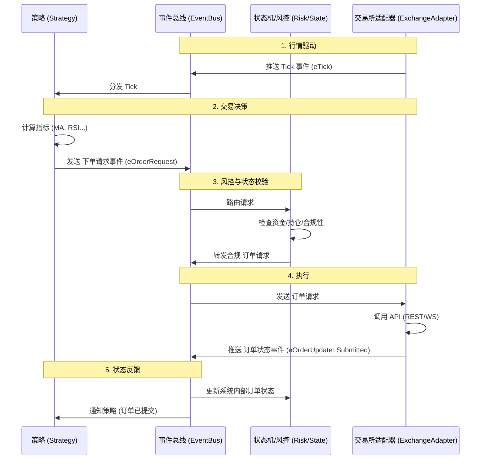
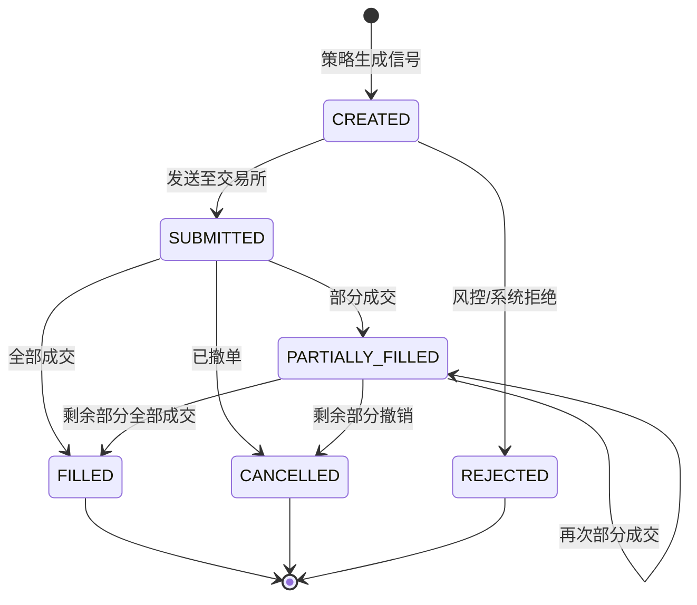

# 量化交易系统 - 架构与详细设计文档

## 目标描述
构建一个基于Python的高扩展性量化交易系统，采用 **事件总线 + 状态机** 架构。
当前阶段专注于 **业务逻辑 (Business Logic)** 和 **模拟环境 (Mock Environment)** 的详细定义。

## 详细业务流程设计 (Core Business Flows)

### 1. 事件驱动流程 (Event Bus Flow)
核心思想：各组件不直接调用对方，而是通过“事件”进行交互。



### 2. 订单状态机 (Order State Machine)
我们将严格定义订单的生命周期，确保 Mock 系统能覆盖所有边缘情况。



## 模拟环境详细需求 (Mock Environment Specs)
Mock 框架必须能模拟以下 **具体场景**，不仅仅是简单的回单。

### A. 基础功能
1.  **行情回放**: 加载 CSV/Parquet 历史数据，按时间戳推送 Tick。
2.  **撮合引擎**: 简单的限价单/市价单撮合逻辑 (Price-Time Priority)。

### 1. 核心事件引擎 (Core Event Engine)
- **角色**: 系统的“中枢神经”。
- **机制**: **发布/订阅 (Pub/Sub) + 回调注册 (Callback Registry)**。
- **设计原则**:
    - **总线是“盲”的**: 总线内部不包含任何业务逻辑（如 `if event == ORDER: do_risk()`），仅维护 `Topic -> List[Callback]` 的映射表。
    - **分发机制**: 收到事件后，查找注册表，依次同步/异步调用回调函数。
- **功能**:
    - 接收来自交易所（或Mock）的行情数据和订单回报。
    - 将数据推送到订阅了该数据的策略模块。
    - 接收策略发出的交易指令，并转发给执行模块。

### 2. 事件类型管理 (Event Type Strategy)
- **管理策略**: **集中式 Topic + 标准化 Payload**。
- **Topic定义**: 所有的 Event Topic 字符串常量（如 `eTick`, `eOrder`）集中定义在 `core/event.py`。
- **状态区分**: 具体的业务状态（如 `FILLED`, `CANCELLED`）由 Event 携带的 **Payload 数据对象** (如 `OrderData.status`) 决定，不为此创建单独的 Topic。

### B. 高级异常模拟 (Chaos Engineering)
1.  **网络延迟 (Latency)**:
    - 配置参数: `latency_mean=100ms`, `latency_std=20ms`。
    - 效果: `send_order` 后，不会立即收到 `SUBMITTED` 回报，而是随机延迟。
2.  **网络丢包/断连 (Disconnect)**:
    - 场景: 模拟 WebSocket 突然断开，策略端必须触发重连机制 (`reconnect`)。
    - 验证点: 策略在断网期间是否会错误地能够重复下单？(应被风控拦截)
3.  **订单拒单 (Rejection)**:
    - 场景: 模拟交易所返回 "Insufficient Balance" 或 "System Busy"。
    - 验证点: 状态机能否正确流转至 `REJECTED` 并通知策略停止发单。
4.  **复杂成交 (Complex Fills)**:
    - 场景: 一个大单分 5 次 `PARTIALLY_FILLED`，最后一次才 `FILLED`。
    - 验证点: 策略是否在第一次部分成交通过后就错误地认为交易完成了？

## 阶段 2: 数据模型与接口定义 (Data & Interface Design)

### 1. 标准化数据结构 (Standard Data Models)
为了屏蔽不同交易所的差异，系统内部将强制使用以下统一数据结构（使用 Python `dataclass` 定义）。

#### 基础行情 (TickData)
| 字段 | 类型 | 说明 |
| :--- | :--- | :--- |
| `symbol` | str | 系统统一代码, 如 `BTC-USDT-SWAP` |
| `exchange` | Enum | 交易所枚举, `OKX`, `BINANCE` |
| `timestamp` | float | 交易所匹配时间 (Unix ms) |
| `last_price` | float | 最新成交价 |
| `volume` | float | 最新成交量 |
| `bid_price_1` | float | 买一价 |
| `ask_price_1` | float | 卖一价 |
| `funding_rate`| float | 资金费率 (保留字段, 默认0) |

#### 订单信息 (OrderData)
| 字段 | 类型 | 说明 |
| :--- | :--- | :--- |
| `order_id` | str | 系统内部唯一ID (Client Order ID) |
| `exchange_order_id`| str | 交易所返回的ID (可为空) |
| `direction` | Enum | `LONG`, `SHORT` |
| `offset` | Enum | `OPEN`, `CLOSE` (**强制双向持仓模式**) |
| `price` | float | 委托价格 |
| `volume` | float | 委托数量 |
| `traded` | float | 已成交数量 |
| `status` | Enum | `SUBMITTED`, `PARTIALLY_FILLED`, `...` |

### 2. 核心抽象接口 (Abstract Base Classes)

#### 交易所接口 (`BaseExchange`)
所有交易所（包括 Mock）必须实现的方法：
- `subscribe(symbols: List[str])`: 订阅行情
- `send_order(req: OrderRequest) -> str`: 发单，返回本地 `order_id`
- `cancel_order(order_id: str)`: 撤单
- `query_position()`: 查询持仓 (通过事件回调返回)
- `query_account()`: 查询账户资金 (通过事件回调返回)

#### 策略接口 (`BaseStrategy`)
策略基类提供的标准回调：
- `on_tick(tick: TickData)`: 收到行情推送
- `on_order_status(order: OrderData)`: 订单状态变化
- `on_init()` / `on_start()` / `on_stop()`: 生命周期管理
- `buy()` / `sell()` / `cover()` / `short()`: 便捷下单方法

### 3. 事件定义清单 (Event Definition)
| 事件 Topic | 携带数据 (Data) | 描述 |
| :--- | :--- | :--- |
| `eTick` | `TickData` | 行情更新 |
| `eOrderRequest` | `OrderRequest` | 策略发起的下单请求 |
| `eOrderUpdate` | `OrderData` | 交易所/状态机反馈的订单状态 |
| `eTrade` | `TradeData` | 成交明细推送 |
| `eLog` | `LogData` | 日志信息 (用于界面显示或文件记录) |
| `eError` | `ErrorData` | 系统级异常/交易所报错 |

## 阶段 3: 项目结构与环境规划 (Structure & Environment)

### 1. 目录结构 (Directory Layout)
```text
quant_system/
├── core/               # 核心层 (Core)
│   ├── event.py        # 事件引擎
│   ├── types.py        # 数据类与枚举
│   └── state.py        # 状态机逻辑
├── exchange/           # 交易所层 (Exchange)
│   ├── base.py         # 抽象基类
│   ├── mock_adapter.py # 模拟交易所实现
│   └── okx_adapter.py  # OKX 实盘实现
├── strategy/           # 策略层 (Strategy)
│   ├── base.py         # 策略基类
│   └── demo_strategy.py
├── utils/              # 工具层 (Utils)
│   ├── logger.py       # 日志模块
│   └── config.py       # 配置加载
└── main.py             # 启动入口

tests/                  # 测试目录
├── unit/               # 单元测试
└── integration/        # 集成测试 (Mock验证)
```

### 2. 依赖管理 (Technology Stack)
- **Python**: 3.10+ (支持 Type Hints)
- **CCXT**: `ccxt>=4.0` (交易所API)
- **Pydantic**: `pydantic>=2.0` (数据校验与配置)
- **Aiohttp**: 异步网络请求 (若CCXT不够用)
- **Pytest**: 测试框架

### 3. 编码规范与工具链 (Coding Standards)
为了保证代码质量，所有提交必须通过以下检查：
- **Type Hints**: 100% 覆盖率。禁止隐式 `Any`。使用 `mypy --strict`。
- **Linter**: 使用 `ruff` 或 `flake8`。
- **Formatter**: 使用 `black` 或 `ruff format`。必须遵守 `line-length = 88`。
- **Docstrings**: Google Style。每个 Public Class/Method 必须有文档字符串。
- **Imports**: 使用 `isort` 排序。

## 阶段 4: 配置设计 (Configuration Design)

### 1. 系统配置 (`config.yaml` 结构预设)
系统将尽量通过配置文件而非硬编码来管理行为。

```yaml
system:
  log_level: "INFO"
  event_loop_policy: "uvloop"  # 可选性能优化

exchange:
  okx:
    api_key: "..."
    passphrase: "..."
    testnet: true
  mock:
    initial_balance: 10000.0
    leverage: 1.0        # 初始杠杆倍数 (运行中不可变)
    latency_ms: 100
    latency_std: 20
    match_algo: "PRICE_TIME" # 撮合算法

strategy:
  active: ["DemoStrategy"]
  symbols: ["BTC-USDT-SWAP", "ETH-USDT-SWAP"]
```

### 4. 异步通信与控制流 (Async Design)
- **控制原语**: 摒弃粗暴的 `while True: sleep()` 轮询。
- **优雅控制**: 使用 `asyncio.Event` (如 `stop_event`, `connected_event`) 来控制服务生命周期（启停、暂停、重连），实现零延迟响应和资源低消耗。
- **并发模型**: WebSocket 读取循环与策略计算逻辑若有冲突，需考虑通过 `Loop` 隔离或 Task 分离。

## 阶段 5: 部署与隔离策略 (Deployment & Isolation)
应用户要求，**Mock 框架必须仅用于本地开发**，生产环境需轻量化部署。

### 1. 依赖分离
- **生产依赖 (`dependencies`)**: `ccxt`, `aiohttp`, `pydantic`.
- **开发依赖 (`dev-dependencies`)**: `pytest`, `pandas` (若仅用于生成数据), `matplotlib` (若有), `faker`.
- 部署时仅安装生产依赖：`pip install --no-dev` 或 `poetry install --only main`.

### 2. 代码打包隔离
设计必须支持在生产环境**物理剔除** Mock 代码而不影响运行。
- **动态导入**: 系统启动时，仅当 `config.exchange.name == 'mock'` 时才 import `mock_adapter`。生产环境若无此文件，只要不配置使用 Mock，系统不应报错。
- **文件排除**: 部署脚本 (`deploy.sh`) 将配置为排除 `tests/` 和 `quant_system/exchange/mock_adapter.py` 等文件。
